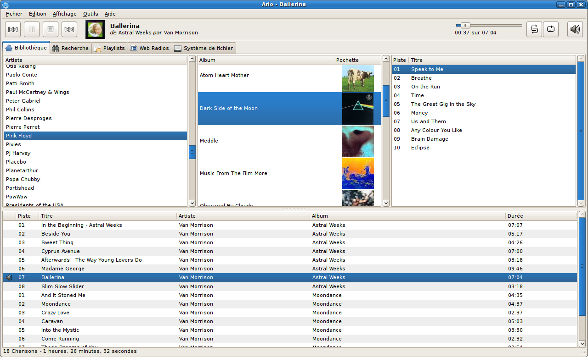

# Ario

## What is Ario?

Ario is a GTK3 client for MPD ([Music player daemon](http://musicpd.org)). The interface used to browse the library is inspired by Rhythmbox but Ario aims to be much lighter and faster.
It runs on various Unixes (Linux, OpenBSD, Mac OS X...) and Microsoft Windows.

## Installation
### Linux
Easiest way to install Ario is to use packages provided by your Linux distribution.

### Microsoft Windows
You can install Ario with the EXE installer provided with each release.

## Compile
### Linux
Install all needed dependencies and then compile Ario using:
- ./autogen.sh
- make

And install it with:
- make install

Example of dependencies installation on Debian based systems:
- apt-get install -y intltool libcurl4-gnutls-dev libmpdclient-dev libgtk-3-dev libglib2.0-dev libavahi-client-dev libtagc0-dev libavahi-glib-dev automake autoconf libtool build-essential

### Windows
Ario can be compiled for Windows using MSYS2. A good example is available in [Windows compilation workflow](https://github.com/mpavot/ario/blob/master/.github/workflows/windows.yml).
